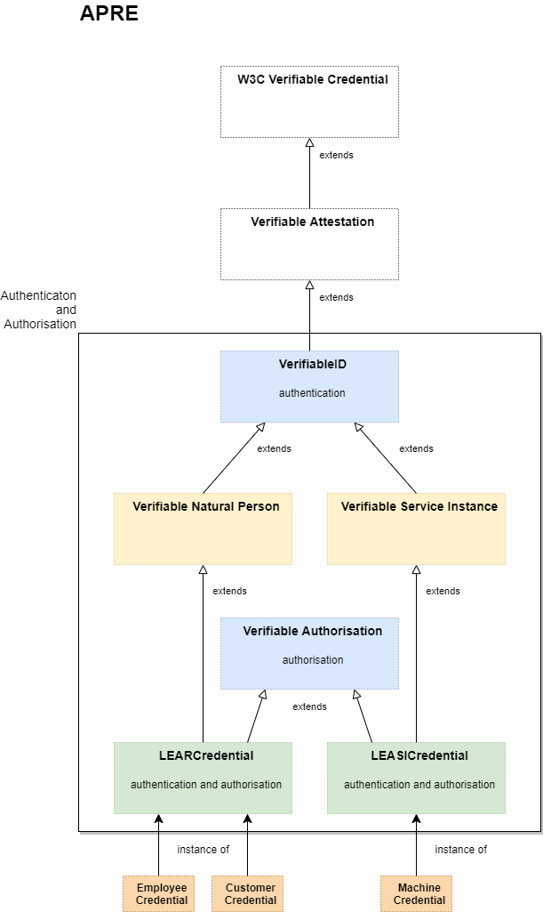
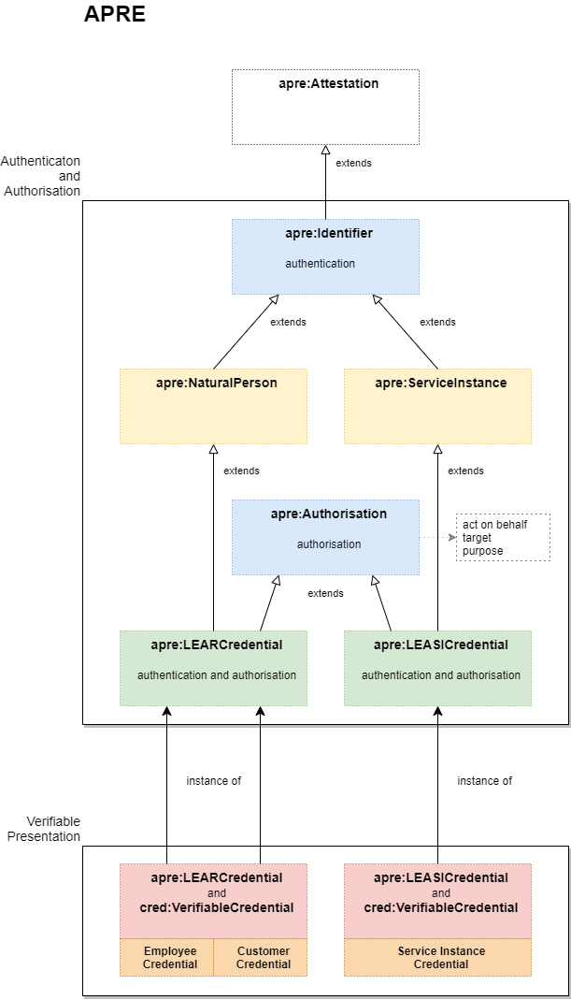

# APRE Version 1

"APRE", the ontology for Appointed Representatives, acting on behalf Legal Entities.

> > > **CAUTION**
>
> - all definitions sometimes are a *little* underspecified* :-(
> - all specification might contain *bugs*, that will be eliminated in future :-)
> - current status is something like a **draft**
> - ...hopefully being a good starting point
> - so far **NOT** usable for production!
>
> > > **CAUTION**

> > > **CHANGES (2023-07-17) to last contribution**
>
> - Ontology fetches its own Repository (as seen here)
> - prefix `elsi` moves to prefix `apre`
> - **APRE** Data Model [APRE-DM] introduces class *Artificial Agent* (`apre:ArtificialAgent`) *Service Instance* is derived from
> - v3 image shows 'act on behalf', 'target' and 'purpose'
> 
> > > **CHANGES to last contribution**

J. Langkau

---

## Editors

- Jörg Langkau (nicos AG}

## Authors

- Jésus Ruiz (Alastria)
- The DOME project participants

---

## Abstract

This document describes the architecture of "Appointed Representatives, acting on behalf of Legal Entities" (**APRE
**, as concept) Data Model [APRE-DM].

---

## Table of Content

- [Introduction](#introduction)
- [Conventions](#conventions)
- [Model](#model)
- [Versions](#versions)
    - [Version 1.1](#version-11)
    - [Version 1.2](#version-12)
    - [Version 1.3](#version-13)
- [See Also](#see-also)
- [References](#references)

*Table of content 'Appointed Representatives', **APRE***.

---

## Introduction

---

## Conventions

- prefix: `apre`
- namespace URI: "https://github.com/nicosResearchAndDevelopment/APRE/tree/main/v1/"

---

## Model

Given model (following version 3 so far) is very aligned to semantics of

- oid (alignments to X.500, etc.)
- ETSI-ESI
- eIDAS (certificates)

Being precise, it introduces [`x-etsi-esi` (extension for EIDAS ESI)](./x-etsi/) and [`x-eidas` (extension for eIDAS)](./x-eidas/), showing the given path to
**APRE**.

Expression of given Subject (*Natural Person* (version 1) and  *Service
Instance* (version 2, 3)) the semantics fit to given X.509-subject properties, those are well known, well-defined, stable and borrowed from X.500, etc. It drills down the problem of "many cooks have many ingredients", but they are strictly bound (`skos:relation`) to ETSI-ESI/eIADS.

`oid`: see an example...

- here: ["organizationIdentifier", (http://oid-info.com/cgi-bin/display?oid=2.5.4.97&a=display)](http://oid-info.com/cgi-bin/display?oid=2.5.4.97&a=display)

*or*

- here: ["organizationIdentifier", (https://oidref.com/2.5.4.97)](https://oidref.com/2.5.4.97).

All version are based on this. Differences between those are not such big, following the same idea of "given Agent acts on behalf". (See also ["Extending Actor Models in Data Spaces", (2023)](https://www.researchgate.net/publication/370414004_Extending_Actor_Models_in_Data_Spaces)).

Information Model, at this time in `turtle` (`json-ld-@context-thingy` will follow and is started [here, very imperfect](./apre.json)), please click here: [apre.ttl (Buy it now!!! Fresh version 3!!!)](./apre.ttl).

---

## Versions

### Version 1.1

Jesus Ruiz, Alastria

- the concept of "Legal Entity Appointed Representative" (as given credential "**LEARCredential
  **") inspired by European Commission's idea of agent *LEAR*.

Picture taken from [Authentication and authorization of entities acting on behalf of legal persons with Verifiable Credentials under eIDAS framework (Jesus Ruiz)](https://alastria.github.io/did-method-elsi/authn.html).

*Overview of 'Legal Person with Verifiable Credential'.*

---

### Version 1.2

Jörg Langkau, nicos AG

This version ("derived" from Jesus' Ruiz Version 1.1) introduces:

- layer (yellow) of *Verifiable Natural
  Person* ([ETSI-ESI- and eIDAS-alignment](https://www.etsi.org/deliver/etsi_ts/119600_119699/119612/02.01.01_60/ts_119612v020101p.pdf)) and
  *Verifiable Service Instance*.
- decouples the *Verifiable Authorisation*.
    - ...it makes it `optional` to given credentials **LEARCredential** and **LEASICredential**.
- the concept of "Legal Entity Appointed Service Instance" (**LEASICredential**, spoken: "
  *Lizzy*"), a given Service Instance 'acts on behalf' another agent, a *Legal Entity*.

*Overview of "APRE v1.2".*

---

### Version 1.3

Langkau, nicos AG

This version ("derived" from Version 1.2) decouples *Verifiable Attestation* from class [*Verifiable
Credential*](https://www.w3.org/TR/vc-data-model-2.0/) (with new naming *Attestation*):

Pros:

- not strictly bound to `cred:VerifiableCredential`
- works "stand alone"
- can be used in other use cases, too!
- maximum flexibility

*Overview of "APRE v1.3"*

---

## APRE Version 1.1, 1.2 and 1.3

All versions do the same (from the perspective of class **LEARCredential** and **LEASICredential**).

## Protocol

[here](./protocol/).

## Purpose

[here](./purpose/).

## See also

**APRE**, mainly inspired and influenced by:

- [Authentication and authorization of entities acting on behalf of legal persons with Verifiable Credentials under eIDAS framework](https://alastria.github.io/did-method-elsi/authn.html).
    - Jesus Ruiz
    - The DOME project participants

- [DID ETSI Legal person Semantic Identifier Method Specification (did:elsi)](https://alastria.github.io/did-method-elsi/)
    - Jesus Ruiz (JesusRuiz)
    - Alejandro Nieto (DigitelTS)
    - Alejandro Alfonso (DigitelTS)
    - Oriol Canades (IN2)
    - Jörg Langkau (nicos AG)

- ["Extending Actor Models in Data Spaces", (2023)](https://www.researchgate.net/publication/370414004_Extending_Actor_Models_in_Data_Spaces)).
    - zum Felde
    - Bellebaum
    - Brost
    - Kollenstraat
    - Dalmolen

## References

---